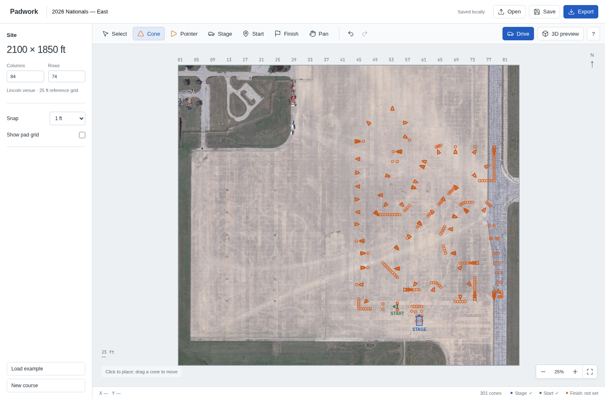
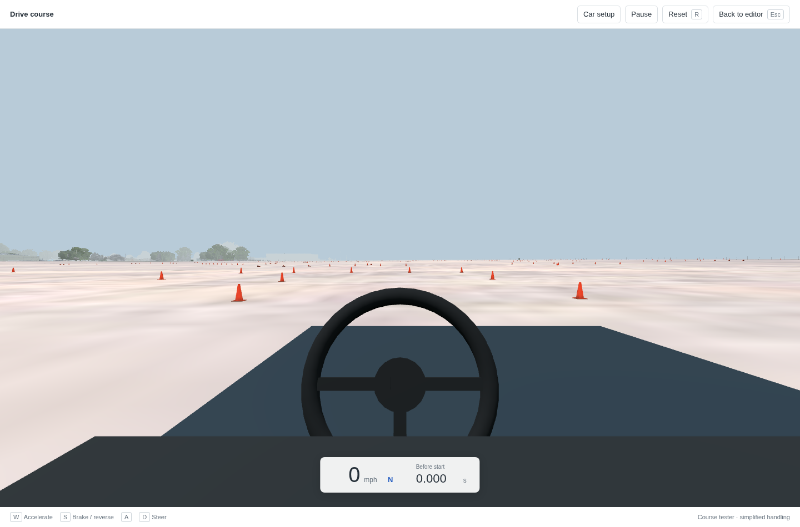
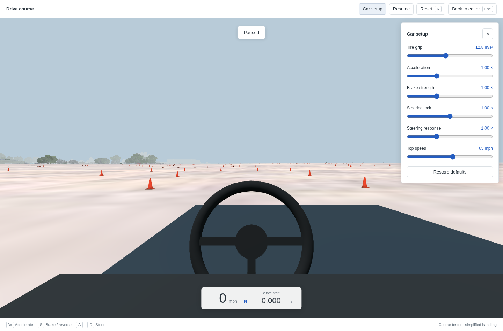
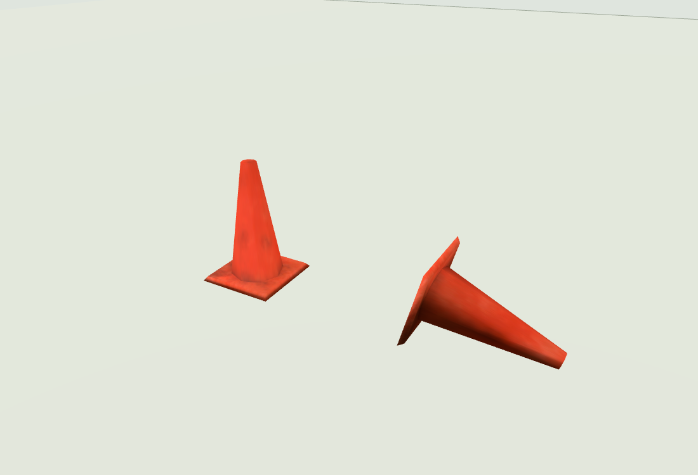
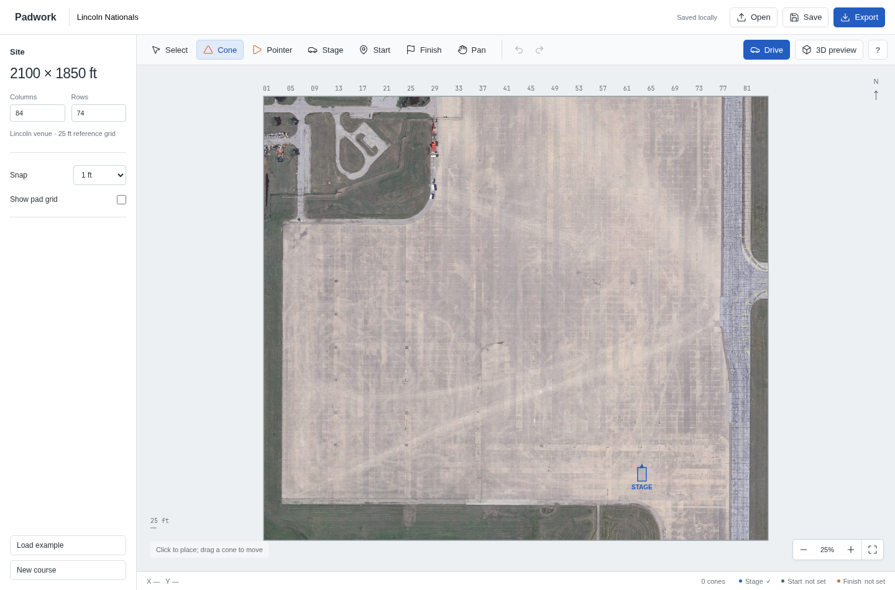

# Padwork · Autocross AC Editor

Build autocross courses on a concrete pad grid, drive them in your browser, and export track source files for Assetto Corsa.



[Open the browser app](https://stevenmatchett.github.io/autocross-ac-editor/)

## Get started

Use Node.js 22.12+ and npm.

```sh
npm ci
npm run dev
```

Open **http://localhost:5173**. Choose **Load example**, then **Drive** to try the Nationals course, or start placing cones on the Lincoln venue to create your own.

## Build a course

- The Lincoln venue is always loaded. Its fixed work area has an optional **25 × 25-foot** (7.62 × 7.62 m) reference grid.
- Place **18-inch orange cones** or sideways pointer cones, using the Nationals mod’s original mesh and worn orange texture.
- Drag existing cones to move them. Rotate pointers to show the direction of travel.
- Set **staging** for the car spawn, **start** for the timing line, and **finish** to end the run.
- Snap to 1-foot, 5-foot, or 25-foot spacing, or turn snapping off.
- Inspect the course in an orbitable **3D preview**. Select a cone first to inspect it close up.
- Undo/redo edits, save a JSON layout, or reopen one later. The editor also autosaves in your browser.

The work area is 2100 × 1850 feet. Cone bases are approximately 0.2914 m squares; locator rings in the editor do not change their physical size. Pointer cones rest on their base edge and tip.

### Editor shortcuts

| Action | Control |
| --- | --- |
| Select / upright cone / pointer cone | V / C / P |
| Staging / start / finish | G / S / F |
| Pan | H, or Space + drag |
| Zoom | Mouse wheel |
| Rotate selected object 15° | R |
| Delete selected object | Delete |
| Undo / redo | Ctrl/Cmd+Z / Ctrl/Cmd+Shift+Z |

Headings use 0° for north and 90° for east. Gate arrows show the direction of travel. Editing works best with a desktop mouse and keyboard. Download JSON backups to keep layouts outside browser storage.

## Drive the course

**Drive** opens a first-person Three.js tester using the current layout. The car starts at staging, which needs enough clearance for the car body.



| Action | Control |
| --- | --- |
| Accelerate | W |
| Brake, then reverse | S |
| Steer | A / D |
| Reset to staging | R |
| Pause / resume | Space |
| Return to editor | Esc |

Cross the start in its arrow direction to begin timing; cross the finish to stop it. A finish is optional for testing. Upright cones, pointer cones, and the site boundary **completely stop the car** on contact.

The handling model includes progressive throttle, speed-dependent power, steering response, and tire grip shared between braking and cornering. The steering wheel and subtle camera motion provide feedback. This is an approximate course tester, not Assetto Corsa physics. Driving does not modify your layout, and losing window focus pauses the car.

### Tune the car

Open **Car setup** to adjust tire grip, acceleration, brake strength, steering lock, steering response, and top speed.



Opening setup pauses driving. Adjust the sliders, then click **Resume** to try the changes. Settings persist in your browser; **Restore defaults** resets them. Car setup affects the browser tester only.

## Nationals example

**Load example** includes a trace of the supplied 2026 Nationals East course:

- **217 upright cones and 84 pointer cones**, traced in a 975 × 1400-foot area and placed on the Lincoln east apron.
- Cones **138–139 establish the exact 75-foot scale**; cone **102 anchors a four-way joint in the original trace grid**.
- Staging sits between cones **101 and 102**, facing the lane between 103 and 104.
- The course retains the PDF orientation without rotation. Other traced positions are approximate.

Labels, route lines, and the finish marker are omitted. **Add a finish before exporting.** Placement of the PDF trace on the venue is approximate. See the [calibration notes](data/README.md).

## Nationals mod assets

Upright and pointer cones use the original geometry and `ConePaintTexture` from [schmerchak/nats-mod](https://github.com/schmerchak/nats-mod), credited to Mike Ferchak. They appear in both Three.js views and the Blender export. Each cone keeps a subtle, repeatable brightness variation.



The templates preserve the original UVs and normals, with height normalized to exactly 18 inches. The original mod’s road, grass, trees, and surrounding scenery form the permanent base. See [asset credits](ASSET_CREDITS.md) and [integration notes](docs/nats-mod-assets.md).

## Lincoln venue

**Lincoln is always loaded**, including when opening the app or starting a new course. Click **Load example** to place the 2026 East course on the east apron, or place your own cones and timing gates. **New course** clears course objects and restores the default staging point while keeping the venue. Example loading and clearing the course are undoable.



The import includes all nine shared venue models, including the paved lot, terrain, trees, fences, toilets, and nearby buildings. Original dimensions and elevations are retained. Cones, timing markers, and the driver's camera follow the source road mesh. The editor work area is fixed at 2100 × 1850 ft; scenery extends beyond it.

The optional 25-foot grid is a measuring overlay, not a surveyed alignment of pavement joints. The 2026 example is translated onto the east apron without changing scale, shape, or headings. Its venue placement is approximate, not a surveyed alignment. Loading the example replaces course objects and is undoable. Older flat JSON layouts are translated onto Lincoln without scaling or rotating their objects; the original browser save is retained under `padwork-legacy-backup` during migration. The tester stops at the source driving-surface boundary; scenery is visual and does not have separate browser collision physics.

The first 3D load downloads about **41 MB**. Textures are resized, and Assetto Corsa shaders are approximated for Three.js/glTF. Export includes the same converted venue in `lincoln.glb`, placed at the same coordinates, plus course-object elevations. Blender extracts venue textures when generating the FBX; ksEditor material setup and in-game validation remain required.

## Export to Assetto Corsa

**Export track produces source files, not an installable game track.** You need Blender and the Assetto Corsa SDK's ksEditor to finish the conversion.

1. Place staging, start, and finish, then choose **Export track**.
2. Extract the ZIP and run `blender --background --python build_track.py` from that directory.
3. Open the generated FBX in **ksEditor**, configure shaders/materials, and export the KN5 into the included track folder.
4. Copy the completed folder into Assetto Corsa's `content/tracks` directory and verify it in-game.

The ZIP contains the JSON layout, Blender scene/FBX generator, the original cone texture and mesh templates, track configuration (`models.ini`, `data/surfaces.ini`, `ui/ui_track.json`), and conversion instructions. Staging supplies pit and hotlap spawns; start and finish supply timing markers.

Upright and pointer cones export as fixed collision meshes named `1WALL_cone_*` and `1WALL_pointer_*`. Preserve these names in ksEditor. Actual stopping, rebound, or climbing over cone geometry must be checked in-game; the export does not include the browser tester's speed-reset logic.

The Blender/ksEditor/game pipeline has not been tested in those applications. KN5 compilation, AI lines, and game preview images are not included. The generator clears the Blender scene, so run it in a fresh session. Track conventions follow the [track creation guide](https://assettocorsamods.net/threads/build-your-first-track-basic-guide.12/).

## Hosting

GitHub Pages serves the app at **https://stevenmatchett.github.io/autocross-ac-editor/**. In repository **Settings → Pages**, select **GitHub Actions** as the source. The [deployment workflow](.github/workflows/pages.yml) tests, builds, and publishes every push to `main`; it can also be run manually from the Actions tab.

Vite uses `/autocross-ac-editor/` for production assets and `/` for local development. No server or API keys are needed. Browser saves on the hosted site are separate from localhost; use JSON save/open to transfer courses.

## Development

TypeScript, Vite, Canvas 2D, Three.js, and fflate. No backend.

```sh
npm test          # Unit tests
npm run build     # Type-check and build
npm run preview   # Serve the production build
```

With the dev server running and Chromium at `/usr/bin/chromium`:

```sh
node tests/browser.mjs
node tests/driving-browser.mjs
node tests/venue-browser.mjs
node scripts/capture-screenshots.mjs
```

Tests cover editing, persistence, real-world dimensions, example calibration, source export, driving controls, collisions, timing, tuning, and browser lifecycle. The screenshot script refreshes the images in this README using a fresh browser session.

| File | Purpose |
| --- | --- |
| `src/main.ts` | Editor interactions and rendering |
| `src/model.ts` | Units, layout schema, and example loading |
| `src/cone-material.ts` | Repeatable cone wear and portable textures |
| `src/course-scene.ts` | Shared Three.js course geometry |
| `src/driving.ts` | Car movement, collisions, and timing |
| `src/drive-tester.ts` | First-person view and controls |
| `src/car-setup.ts` | Tuning defaults, ranges, and validation |
| `src/export.ts` | Blender generator and Assetto Corsa source ZIP |
