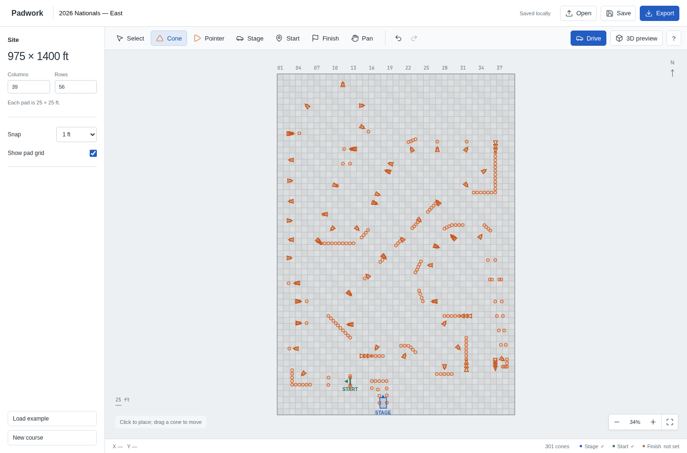
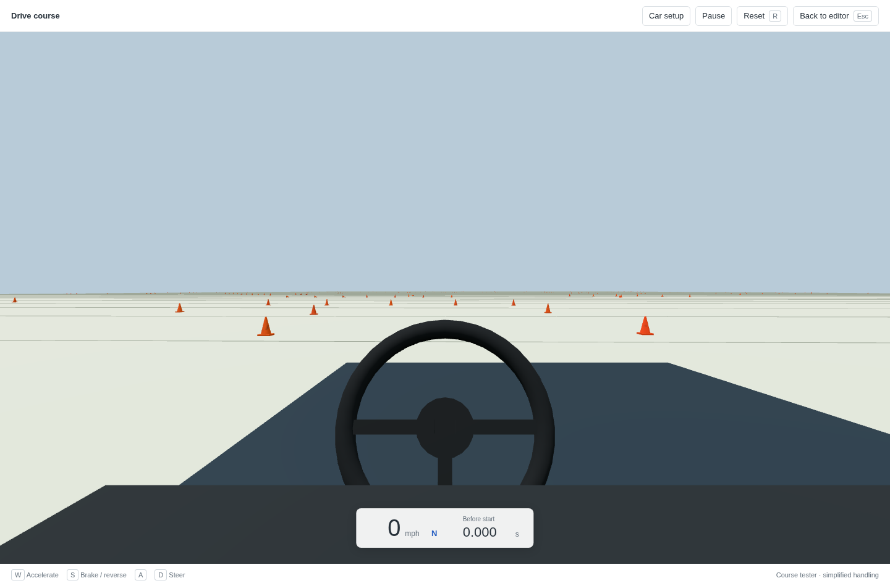
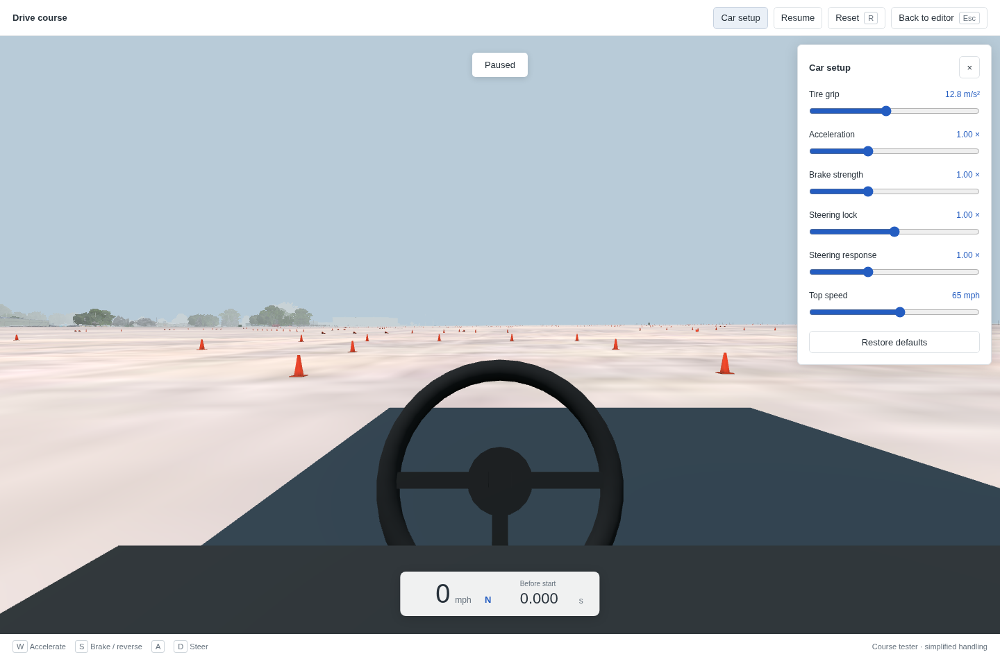
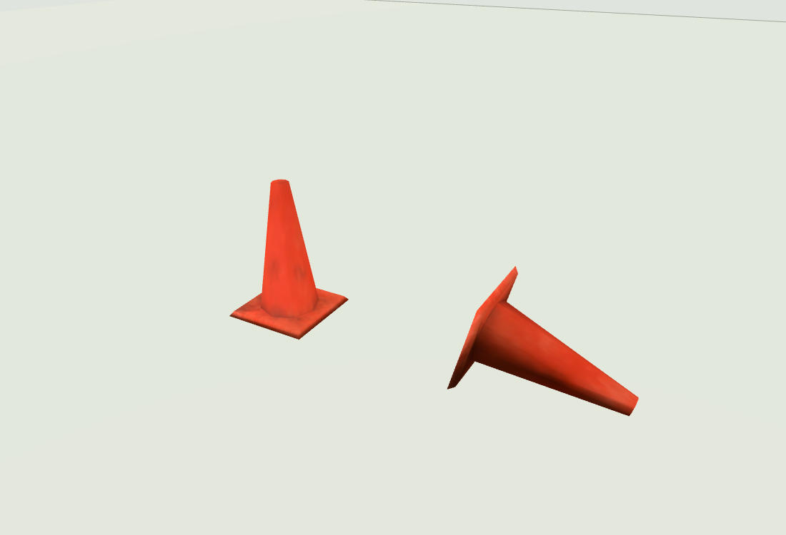
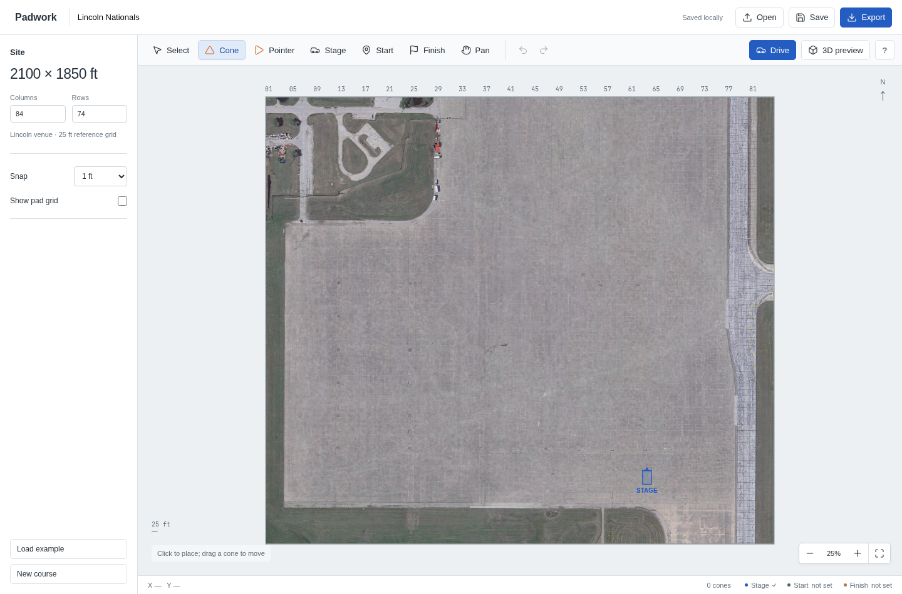

# Padwork · Autocross AC Editor

Build autocross courses on a concrete pad grid, drive them in your browser, and export track source files for Assetto Corsa.



[Open the browser app](https://stevenmatchett.github.io/autocross-ac-editor/)

## Get started

Use Node.js 22.12+ and npm.

```sh
npm ci
npm run dev
```

Open **http://localhost:5173**. Choose **Load example**, then **Drive** to try the Nationals course, or start placing cones on the Lincoln venue to create your own.

## Build a course

- The Lincoln venue is always loaded. Its fixed work area has an optional **25 × 25-foot** (7.62 × 7.62 m) reference grid.
- Place **18-inch orange cones** or sideways pointer cones, using the Nationals mod’s original mesh and worn orange texture.
- Drag existing cones to move them. Rotate pointers to show the direction of travel.
- Set **staging** for the car spawn, **start** for the timing line, and **finish** to end the run.
- Snap to 1-foot, 5-foot, or 25-foot spacing, or turn snapping off.
- Inspect the course in an orbitable **3D preview**. Select a cone first to inspect it close up.
- Undo/redo edits, save a JSON layout, or reopen one later. The editor also autosaves in your browser.

The work area is 2100 × 1850 feet. Cone bases are approximately 0.2914 m squares; locator rings in the editor do not change their physical size. Pointer cones rest on their base edge and tip.

### Editor shortcuts

| Action | Control |
| --- | --- |
| Select / upright cone / pointer cone | V / C / P |
| Staging / start / finish | G / S / F |
| Pan | H, or Space + drag |
| Zoom | Mouse wheel |
| Rotate selected object 15° | R |
| Delete selected object | Delete |
| Undo / redo | Ctrl/Cmd+Z / Ctrl/Cmd+Shift+Z |

Headings use 0° for north and 90° for east. Gate arrows show the direction of travel. Editing works best with a desktop mouse and keyboard. Download JSON backups to keep layouts outside browser storage.

## Drive the course

**Drive** opens a first-person Three.js tester using the current layout. The car starts at staging, which needs enough clearance for the car body.



| Action | Control |
| --- | --- |
| Accelerate | W |
| Brake, then reverse | S |
| Steer | A / D |
| Reset to staging | R |
| Pause / resume | Space |
| Return to editor | Esc |

Cross the start in its arrow direction to begin timing; cross the finish to stop it. A finish is optional for testing. Upright cones, pointer cones, and the site boundary **completely stop the car** on contact.

The handling model includes progressive throttle, speed-dependent power, steering response, and tire grip shared between braking and cornering. The steering wheel and subtle camera motion provide feedback. This is an approximate course tester, not Assetto Corsa physics. Driving does not modify your layout, and losing window focus pauses the car.

### Tune the car

Open **Car setup** to adjust tire grip, acceleration, brake strength, steering lock, steering response, and top speed.



Opening setup pauses driving. Adjust the sliders, then click **Resume** to try the changes. Settings persist in your browser; **Restore defaults** resets them. Car setup affects the browser tester only.

## Nationals example

**Load example** includes a trace of the supplied 2026 Nationals East course:

- **217 upright cones and 84 pointer cones**, traced in a 975 × 1400-foot area and placed on the Lincoln east apron.
- Cones **138–139 establish the exact 75-foot scale**; cone **102 anchors a four-way joint in the original trace grid**.
- Staging sits between cones **101 and 102**, facing the lane between 103 and 104.
- The venue example is rotated 180° from the PDF and shifted 150 feet west from its initial east-apron placement. Other traced positions are approximate.

Labels, route lines, and the finish marker are omitted. **Add a finish before exporting.** Placement of the PDF trace on the venue is approximate. See the [calibration notes](data/README.md).

## Nationals mod assets

Upright and pointer cones use the original geometry and `ConePaintTexture` from [schmerchak/nats-mod](https://github.com/schmerchak/nats-mod), credited to Mike Ferchak. They appear in both Three.js views and the Blender export. Each cone keeps a subtle, repeatable brightness variation.



The templates preserve the original UVs and normals, with height normalized to exactly 18 inches. The original mod’s road, grass, trees, and surrounding scenery form the permanent base. See [asset credits](ASSET_CREDITS.md) and [integration notes](docs/nats-mod-assets.md).

## Lincoln venue

**Lincoln is always loaded**, including when opening the app or starting a new course. Click **Load example** to place the 2026 East course on the east apron, or place your own cones and timing gates. **New course** clears course objects and restores the default staging point while keeping the venue. Example loading and clearing the course are undoable.



The import includes all nine shared venue models, including the paved lot, terrain, trees, fences, toilets, and nearby buildings. Original dimensions and elevations are retained. Cones, timing markers, and the driver's camera follow the source road mesh. The editor work area is fixed at 2100 × 1850 ft; scenery extends beyond it.

The optional 25-foot grid is a measuring overlay, not a surveyed alignment of pavement joints. The 2026 example is rotated 180° onto the east apron and shifted 150 feet toward the lot center (west), preserving scale and shape and rotating all object headings together. Its venue placement is approximate, not a surveyed alignment. Loading the example replaces course objects and is undoable. Older flat Nationals layouts receive the same example placement; other flat JSON layouts are translated onto Lincoln without scaling or rotating their objects; the original browser save is retained under `padwork-legacy-backup` during migration. The tester stops at the source driving-surface boundary; scenery is visual and does not have separate browser collision physics.

The east-apron concrete has a darker gray finish and sharper slab detail informed by [2026 Nationals East in-car footage](https://www.youtube.com/watch?v=eUiUFwDX2AI). This finish is baked into the venue texture used by AC exports. The browser adds close-range concrete grain and subtle joints for the driving view. The original aerial image still supplies the site layout; the video does not establish exact aerial positions for temporary painted lines or tire marks, so those are not copied into the map.

The first 3D load downloads about **42 MB**. Textures are resized, and Assetto Corsa shaders are approximated for Three.js/glTF. Export includes the same converted venue in `lincoln.glb`, placed at the same coordinates, plus course-object elevations. The build command extracts all venue textures and configures materials during direct KN5 compilation. In-game validation remains required.

## Export to Assetto Corsa

**Export track** downloads a source package with a one-command compiler. Install Blender 4.5 or newer (the full Nationals venue build is verified with Blender 5.2.2), place staging, start, and finish, export, and extract the whole ZIP.

On Windows, open PowerShell in the extracted folder:

```powershell
.\Build-Track.ps1 "C:\path\to\export"
.\Build-Track.ps1 "C:\path\to\export" -Install
```

The command locates Blender, builds the scene and KN5, validates the result, and writes `<slug>-install.zip`. Override detected paths with `-BlenderPath "C:\path\to\blender.exe"` and `-ACPath "D:\SteamLibrary\steamapps\common\assettocorsa"`. Installation discovers the active Steam installation and libraries containing app **244210**, verifies `acs.exe`, and refuses to overwrite an existing track. Rename the course for a separate version, or move the previous track yourself before reinstalling.

On Linux/macOS, or to call Blender directly:

```sh
blender --background --python-exit-code 1 --python build_track.py
```

Run it from the extracted package. The script creates a fresh scene, saves an editable `.blend`, embeds diffuse textures with automatic `ksPerPixel` materials, preserves each cone's brightness, and handles venue alpha materials. ksEditor is optional: append `-- --fbx` to also produce an FBX for manual adjustments.

The installation ZIP has this structure:

```text
content/tracks/<slug>/
  <slug>.kn5
  models.ini
  data/surfaces.ini
  ui/ui_track.json
  ui/preview.png
  ASSET_CREDITS.txt
```

The preview is a generated overhead course diagram. Folder, model filename, and `models.ini` match. Visible `cone_*` and `pointer_*` meshes use the original cone geometry. Separate fixed collision boxes named `1WALL_cone_*` and `1WALL_pointer_*` follow each footprint and heading and extend 1.2 m above pavement, with an explicit `WALL` surface. Direct KN5 export makes these boxes nonrenderable automatically; if using FBX/ksEditor, mark them nonrenderable there. Preserve those names, and the venue's `1PROAD`/`1GRASS` names, if editing the scene. AI lines are not included.

The builder parses the entire KN5 and checks embedded texture references, material IDs, triangle indices, mesh vertex limits, expected cones, all six spawn/timing markers, marker position/up/heading, upward Lincoln pavement faces, and every authored position's elevation against the pavement. It validates ZIP paths and model references and writes `validation.json` beside the source files. Marker conversion changes the world basis only: source markers already have local Y-up/Z-forward axes.

Direct export adapts the GPL-3.0 [ac-track-tools writers](https://github.com/nendotools/ac-track-tools/tree/3940bb90614efb82707a0964836563b11dd11f7f/lib/kn5), pinned to commit `3940bb90614efb82707a0964836563b11dd11f7f`. Build-tool source, `COPYING`, and `EXPORTER_NOTICE.txt` are included in every source export. Asset permissions remain documented separately in `ASSET_CREDITS.txt`. To update the bundled scripts, edit `scripts/track-build/` and run `node scripts/bundle-track-build.mjs`; tests/builds reject stale bundles.

**Compiled/validated and tested in-game are separate results.** A previous **2026 Nationals — East** build with Blender 5.2.2 was installed and confirmed working by the user. Its timing and collision behavior were not separately confirmed. The new compiler's binary and geometry checks cannot establish those game behaviors.

For each new build, start **Practice** and check:

- Pit and hotlap spawn location, elevation, upright car orientation, and staging heading.
- Start timing in the gate's arrow direction and finish timing at the finish gate.
- Hit upright and pointer cones slowly and at course speed; verify the desired collision response.
- Inspect pavement alignment, texture coverage, and transparent venue scenery.

Cones are solid fixed obstacles; game physics determine stopping, rebound, or climbing over them. The export adds no browser speed reset, cone penalties, or movable-cone behavior.

## Hosting

GitHub Pages serves the app at **https://stevenmatchett.github.io/autocross-ac-editor/**. In repository **Settings → Pages**, select **GitHub Actions** as the source. The [deployment workflow](.github/workflows/pages.yml) tests, builds, and publishes every push to `main`; it can also be run manually from the Actions tab.

Vite uses `/autocross-ac-editor/` for production assets and `/` for local development. No server or API keys are needed. Browser saves on the hosted site are separate from localhost; use JSON save/open to transfer courses.

## Development

TypeScript, Vite, Canvas 2D, Three.js, and fflate. No backend.

```sh
npm test          # TypeScript + Python 3 unit tests
npm run build     # Type-check and build
npm run preview   # Serve the production build
```

With the dev server running and Chromium at `/usr/bin/chromium`:

```sh
node tests/browser.mjs
node tests/driving-browser.mjs
node tests/venue-browser.mjs
node scripts/capture-screenshots.mjs
```

Reproduce compiler smoke checks with Blender installed:

```sh
npx tsx scripts/export-build-fixture.ts /tmp/padwork-smoke
blender --background --python-exit-code 1 --python /tmp/padwork-smoke/build_track.py -- --fbx
npx tsx scripts/export-build-fixture.ts /tmp/padwork-nationals --venue
blender --background --python-exit-code 1 --python /tmp/padwork-nationals/build_track.py
```

The venue fixture adds a finish to the example solely for compilation. These commands validate build artifacts; they do not run Assetto Corsa.

Tests cover editing, persistence, real-world dimensions, example calibration, source export, driving controls, collisions, timing, tuning, and browser lifecycle. The screenshot script refreshes the images in this README using a fresh browser session.

| File | Purpose |
| --- | --- |
| `src/main.ts` | Editor interactions and rendering |
| `src/model.ts` | Units, layout schema, and example loading |
| `src/cone-material.ts` | Repeatable cone wear and portable textures |
| `src/course-scene.ts` | Shared Three.js course geometry |
| `src/driving.ts` | Car movement, collisions, and timing |
| `src/drive-tester.ts` | First-person view and controls |
| `src/car-setup.ts` | Tuning defaults, ranges, and validation |
| `src/export.ts` | Blender generator and Assetto Corsa source ZIP |
